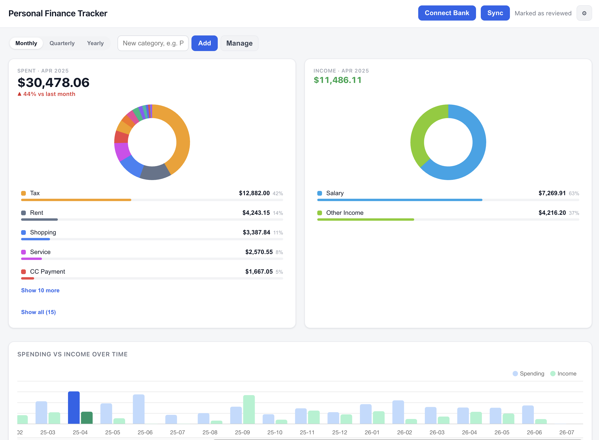
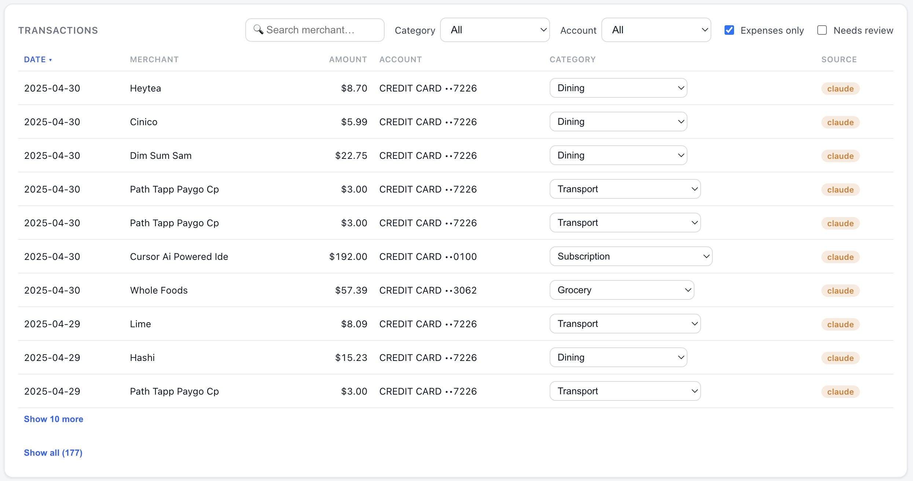

# Personal Finance Tracker

A **local-first** personal finance tracker. It connects to your banks via Plaid,
uses Claude to categorize every transaction (steered by a plain-English guide you
can edit), and shows your spending and income with charts and detail tables.

Everything runs on your own machine with your own API keys — your transactions
live in a local SQLite file (`finance.db`) and never leave your computer.

## Screenshots





## What it does

- **Pulls transactions** from any bank Plaid supports (added / modified / removed,
  with pending→posted de-duplication so a restaurant charge doesn't show up twice).
- **Classifies every transaction with Claude** into spending categories *and*
  money-movement labels (Salary, Other Income, Transfer, Investment, CC Payment,
  Cash, Refund) plus Reimbursement for money paid back to you (P2P settle-ups,
  which net out the expense they offset). A relational pass also nets out
  credit-card payments.
- **You teach it in plain English.** When you correct a transaction you choose:
  *just this once*, *a fixed rule* (the whole merchant or a keyword substring like
  `MT LAW LLC`), or *teach Claude a pattern* (a line appended to
  `categorization_guide.md`). Saved rules are free and deterministic; the guide
  handles the nuanced cases.
- **Review queue that learns.** Transfers, income, and uncertain rows land in a
  **Needs review** list; approving a merchant remembers it so its future
  transactions skip review. A management panel lets you view/delete individual
  rules, trusted merchants, and ignored rows.
- **Spending & income insights**: side-by-side spending and income doughnuts with
  ranked breakdowns, a spending-vs-income trend (Monthly / Quarterly / Yearly),
  recurring/subscription detection, top merchants, and a sortable, filterable,
  searchable transaction table.

## Setup

You need three things, all free to start:

1. **Python 3.10+**
2. A **[Plaid](https://dashboard.plaid.com) account.** New accounts get a free
   **Trial plan** — real data from up to **10 banks**, auto-approved with no
   review — so you can connect your actual bank right away. (Bigger scale or
   certain OAuth banks need full Production approval, ~2 business days.) Grab your
   `client_id` and **Production** secret from the dashboard.
3. An **[Anthropic API key](https://console.anthropic.com)** for classification.

```bash
git clone <your-fork-url> && cd "accounting app"
python -m venv .venv && source .venv/bin/activate
pip install -r requirements.txt

cp .env.example .env          # then paste in your keys (see below)
python app.py                 # http://localhost:5001
```

The SQLite database and your personal `categorization_guide.md` are **created
automatically on first run** — there is no database to set up.

### `.env`

```
PLAID_CLIENT_ID=...        # from the Plaid dashboard
PLAID_SECRET=...           # the secret for the environment below
PLAID_ENV=production       # production = your real banks; sandbox = fake test data
ANTHROPIC_API_KEY=sk-ant-...
CLAUDE_MODEL=claude-haiku-4-5-20251001
FLASK_SECRET=change_me
PORT=5001                  # 5000 is taken by macOS AirPlay
```

> **Just want to see it first?** Set `PLAID_ENV=sandbox` with your sandbox secret,
> run the app, click **Connect Bank**, and log in with `user_good` / `pass_good`
> for instant fake data — no real account needed.

## Usage

1. Open `http://localhost:5001`. It auto-syncs on load (and there's a **Sync** button).
2. **Connect Bank** launches Plaid Link. In sandbox use `user_good` / `pass_good`.
   You can connect multiple institutions. (Sandbox-only seed buttons live under the ⚙ menu.)
3. Pick **Monthly / Quarterly / Yearly** up top; click a bar in the trend chart to
   focus a period. The doughnut, breakdown, income, and transactions all follow it.
4. Click a category slice to filter the transactions; correct any row's category
   to teach the classifier.
5. Edit `categorization_guide.md` anytime — it's injected into every classification,
   so changes take effect on the next sync or **Re-classify** (⚙ menu).

## Tech

Buildless by design: **Flask + SQLite** backend, **vanilla JS + Chart.js** frontend
(no Node, no bundler — just `python app.py`). Claude classification uses the
Anthropic API.

| File | Purpose |
|------|---------|
| `app.py` | Flask routes + correction/learning + period queries |
| `sync.py` | Sync pipeline: pull → classify → finalize → store |
| `plaid_client.py` | Plaid connection, tokens, transactions sync |
| `classifier.py` | Rule-first + Claude classification (amount/direction aware) |
| `denoise.py` | Turns a label into spending bookkeeping + cc-payment pairing |
| `recurring.py` | Recurring / subscription detection |
| `db.py` / `models.sql` | SQLite init, migrations, read/write |
| `categorization_guide.example.md` | Template for the editable guide |
| `templates/`, `static/` | Frontend |

## Privacy

`finance.db`, `.env`, and your personal `categorization_guide.md` are git-ignored
and stay on your machine. Nothing is sent anywhere except Plaid (to fetch your
transactions) and Anthropic (merchant names + amounts, to classify them).

## License

MIT — see [LICENSE](LICENSE).
